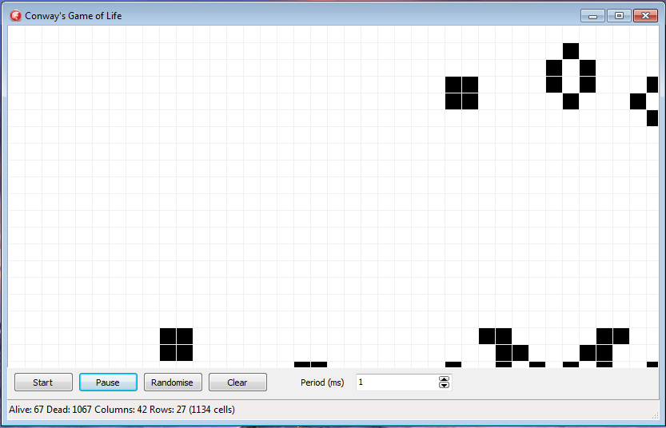

# Conway's Game of Life

This was a simple project written in Delphi to improve my skills in it. More information about Conway's Game of Life can be found [here](https://en.wikipedia.org/wiki/Conway%27s_Game_of_Life).

## Screenshots

Note that each image is from a different random seed.

